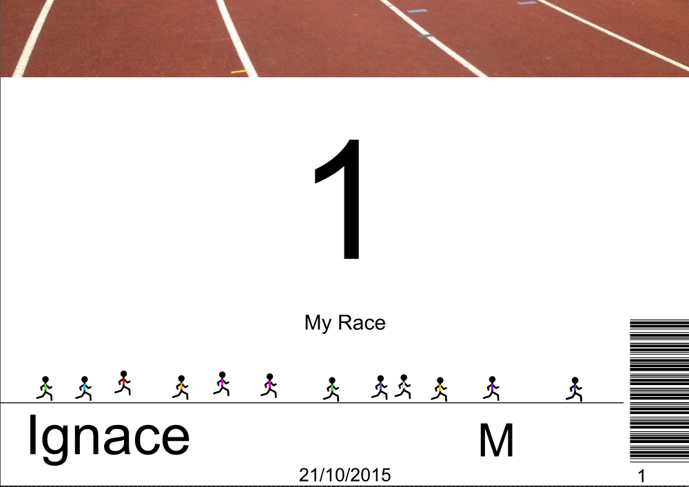

.. bib_factory documentation master file, created by
   sphinx-quickstart on Thu Jan  5 22:09:30 2017.
   You can adapt this file completely to your liking, but it should at least
   contain the root `toctree` directive.

Welcome to bib_factory's documentation!
=======================================

This is the documentation of bib_factory package.
This package will help you create personnalized bibs for your race. It enables
the creation of bibs with personalized fields like name, category, team, etc.
It also provides the possibility to create a barcode for each bib. Barcodes
can then be used to automate/ease the ranking of the participants of your race.

The following pictures give an illustration of the type of personnalization
that can be done using this package.

    Example of personnalized bib created with this package. The bib number, the
    participant's firstname and category are personnalized fields.

This package was initially developped to be used with bibs created as svg files
with inkscape.
It can be used to adapte bibs of any readable text file. However, some of the
capabilities provided by the package assume that Inkscape is available (such as
making the png production script).

In any case, this package is still a rough prototype. Feel free to expand,
adapt, correct it as you like it.

Contents
=========

.. toctree::
    :maxdepth: 2

    intro
    bib_factory
    bib_template
    how_to

Indices and tables
==================

* :ref:`genindex`
* :ref:`modindex`
* :ref:`search`

