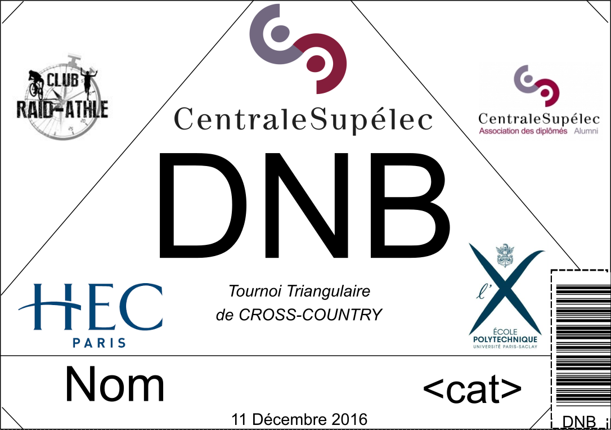
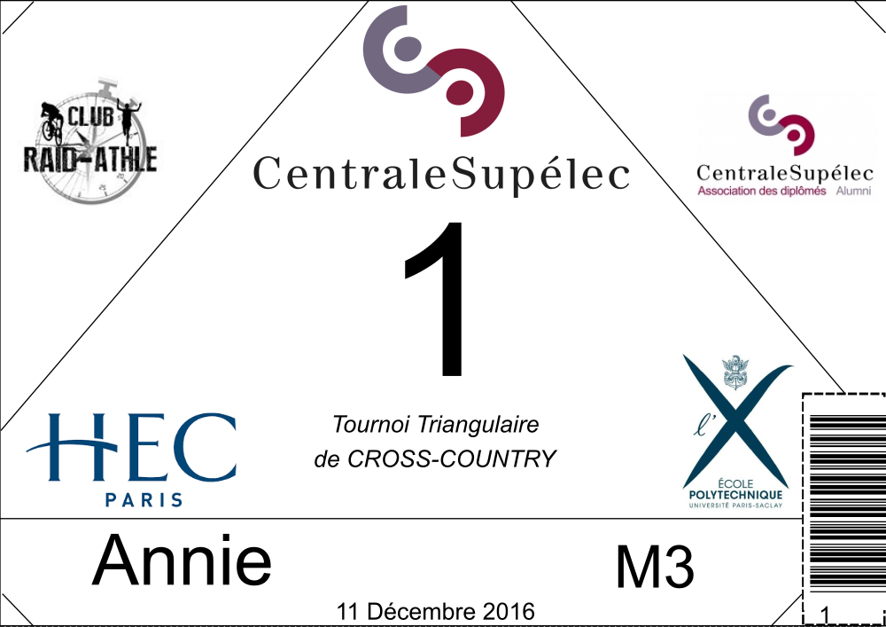

Main idea
=========

The package works with two main objects:
    - templates
    - factories

A factory will basically be associated with a race. It "contains" informations
about the participants of your race, the working directories etc.
Factories are used to produce bibs starting from one or more templates.
A template describes the basic shape of a bib to be personnalized. It can be
used by a factory to produce a series of bib for a given race. A factory should
be able to use different bibs templates without any distinction such that the
race organizer can try various bib designs easily.

Templates are made from svg files. The main idea of templating is to create
templates in wich keywords will be replaced by the values of certain fields in
the participant table. E.g., on the template, the bib number can be noted <BNB>
and this string will be replaced when its  `make_svg_file` method is called.

The following pictures give an illustration of the type of personnalization
that can be done using this package.

    Example of template for personnalized bib creation.

    Example of personnalized bib. The `Name`, `DNB` and `<cat>` fields were
    replaced by the name of a participant, its bib number and the category
    he/she belongs to. The example barcode was also replaced with the barcode
    associated with the participant's bib number.

